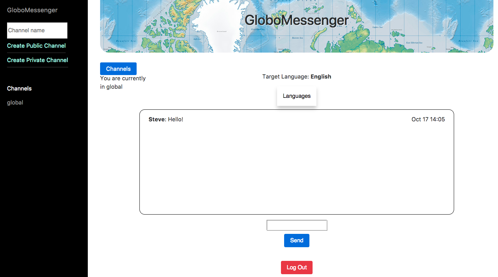

# Mapp

A new messaging app.

Made by [Adam Romano](https://github.com/manoadamro), [Olivia Frost](https://github.com/ofrost617), [Lizzie Hard](https://github.com/lizh90) and [Stephen Geller](https://github.com/stephengeller) in two weeks while at [Makers Academy](http://makersacademy.com), a 12-week software development bootcamp.

## Globomessenger


## How to use

Clone the repo and run it locally. Make sue you have Python 3.6.3 installed, which you can find [here](https://www.python.org/downloads/mac-osx/).

```
$ git clone git@github.com:manoadamro/Mapp.git
$ cd Mapp
$ bash install
$ python3 mapp.py
```
To run the server use ```bash start``` and access in your browser on http://localhost:8080/

## Testing

Run the unit test folder using ```$ bash test ``` in the terminal. The tests will reset all database entries.
To run the feature tests open SpecRunner.html in the browser.

To test coverage run: ```--cov=. tests/``` in the terminal.

## Features

* Chat with online users in a global chatroom
* Receive messages in any language of your choice from a dropdown menu
* Create private chatrooms with one or more
* See a list of users who are in your chatroom
* Create new global chatrooms

## Technologies

  - Back-end: Python, CherryPy
  - Front-end: Javascript, JQuery
  - Testing: unittest (Python), pytest, Jasmine, Travis CI

## Deployment

You can find this deployed [here](http://globomessenger.herokuapp.com/).
